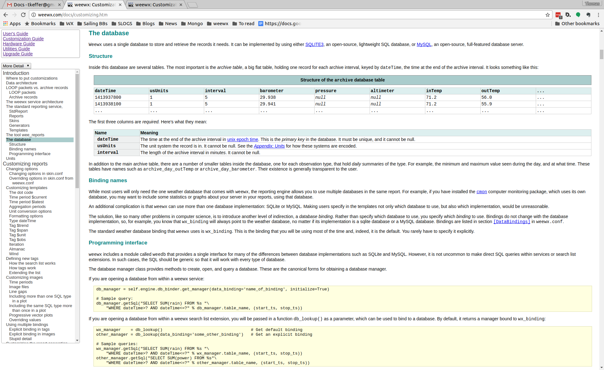
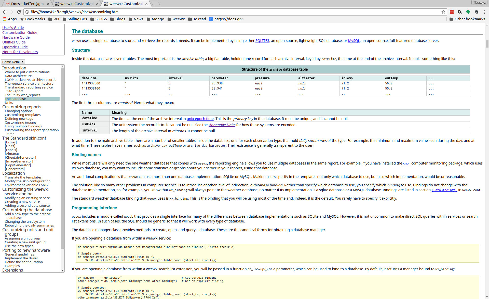
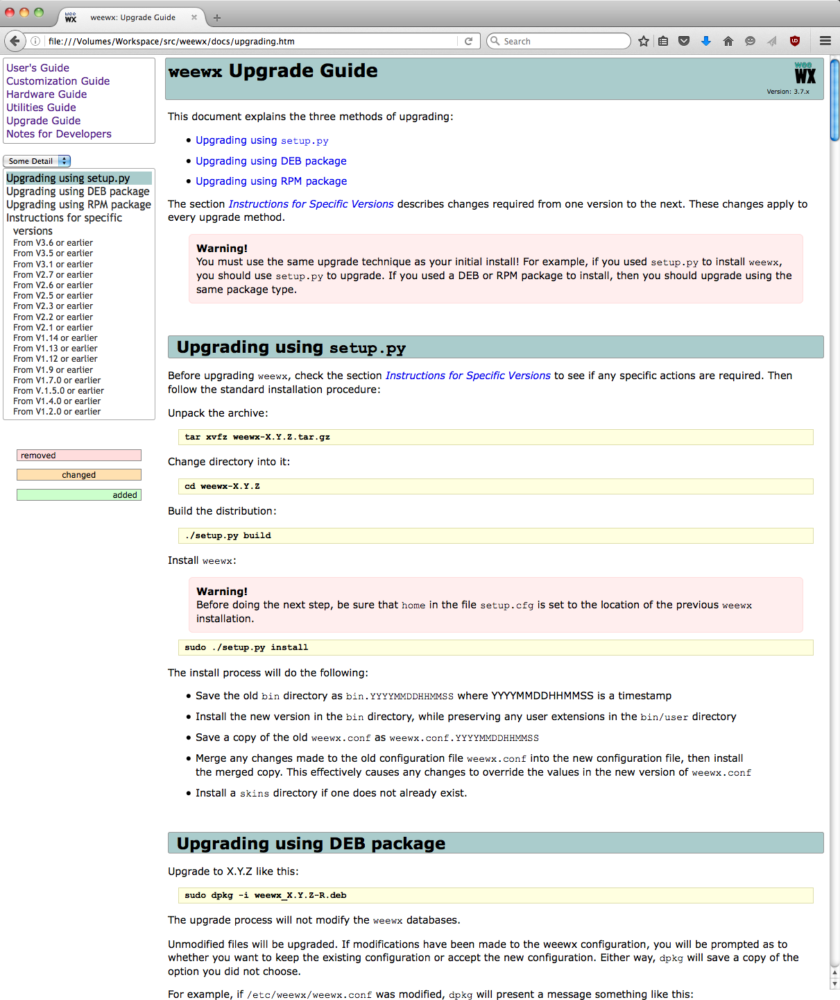
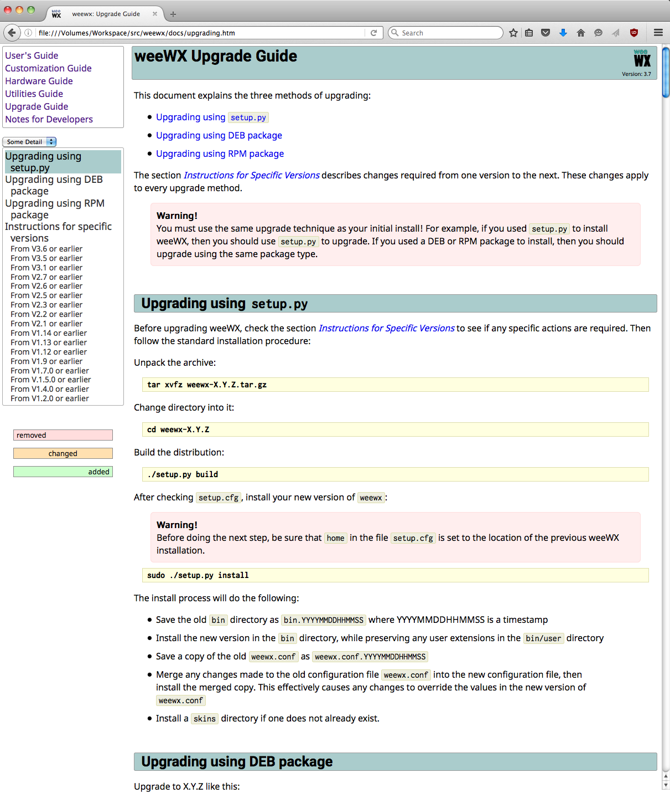
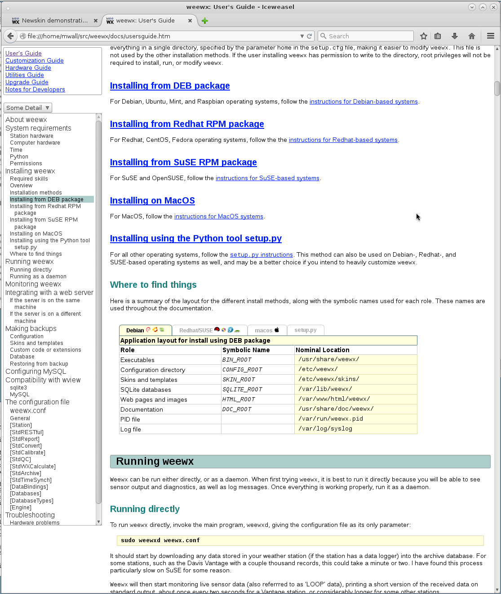
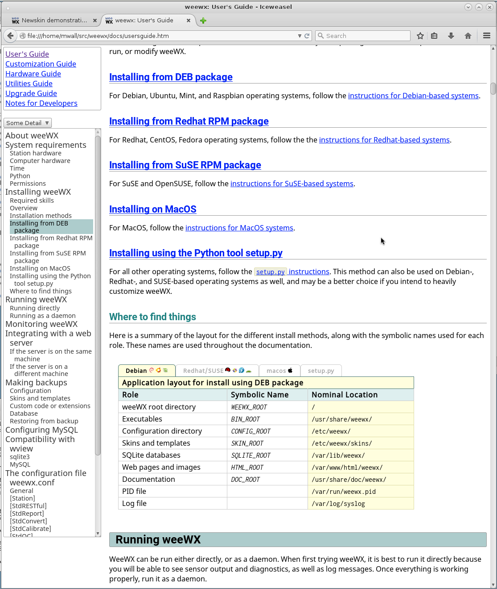
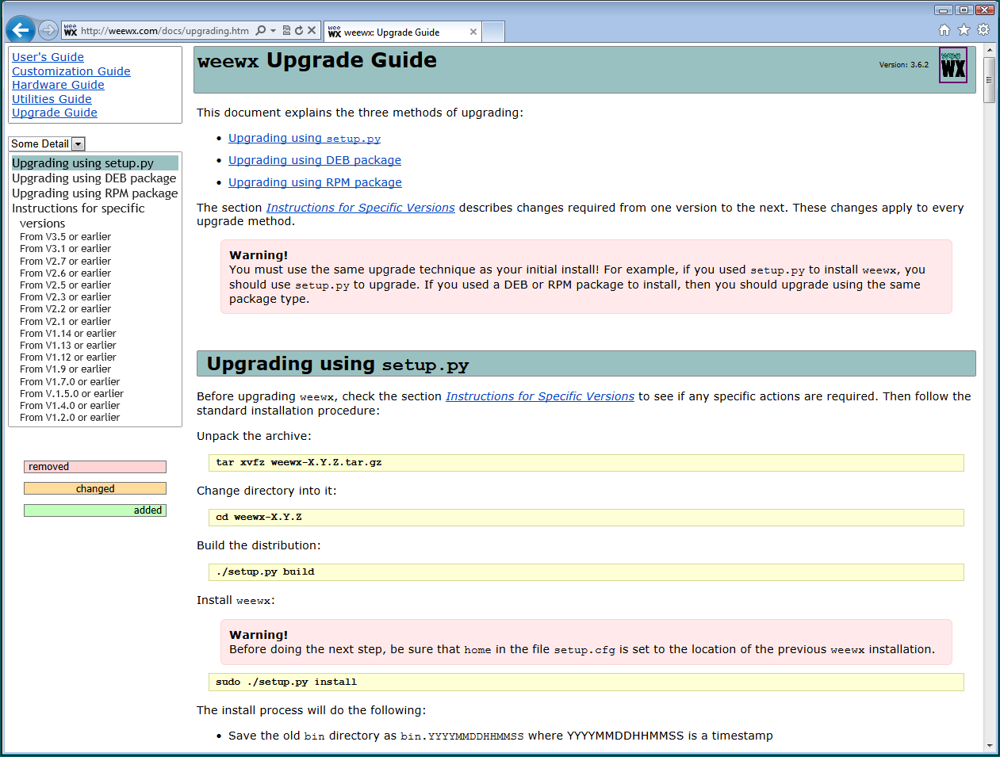
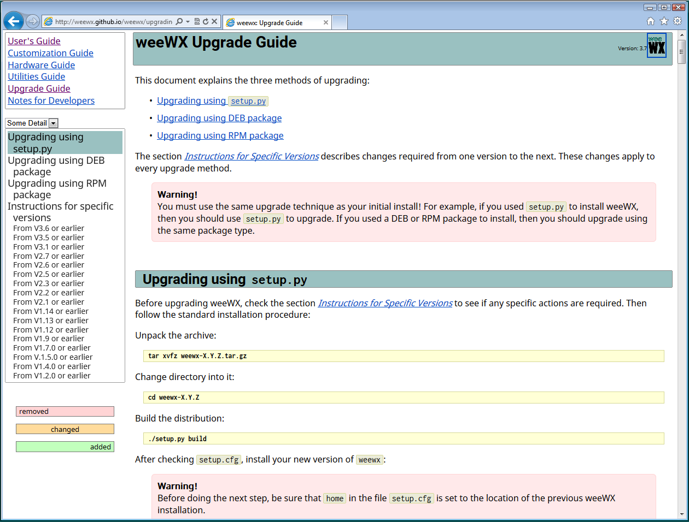
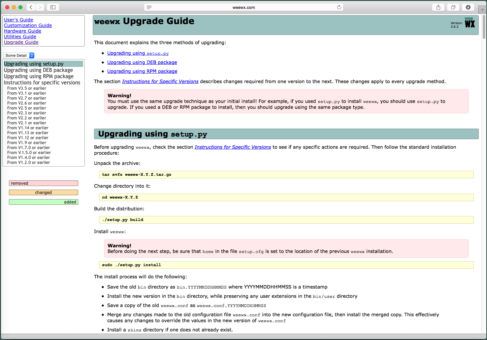
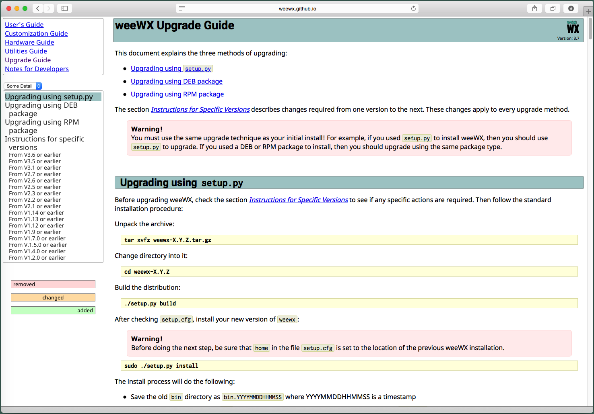

These are screenshots of the v3.6.2 and v3.7.0 docs in various browsers and operating systems.

|   | 3.6.2 | 3.7.0 |
|---|---|---|
| body | Verdana, Arial, sans-serif | NotoSans, sans-serif |
| title, h1-h4 |  | Roboto, sans-serif |
| code, tty | CourierNew, Courier, monospace | Inconsolata, monospace |
| example | TimesNewRoman, Times, serif | DroidSerif, serif |
| stats | Verdana, Arial, Helvetica, sans-serif | NotoSans, sans-serif |

<table>
<tr><th></th><th>3.6.2</th><th>3.7.0</th></tr>
<tr>
<td>chrome ubuntu</td>
<td></td>
<td></td>
</tr>
<tr>
<td>firefox macosx 10.6</td>
<td></td>
<td></td>
</tr>
<tr>
<td>iceweasel debian8</td>
<td></td>
<td></td>
</tr>
<tr>
<td>ie9 win7</td>
<td></td>
<td></td>
</tr>
<tr>
<td>safari macosx 10.10.5</td>
<td></td>
<td></td>
</tr>
</table>
