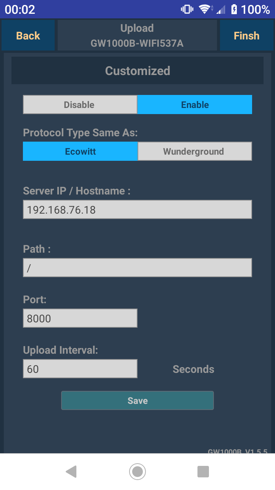

# Collect data from the ecowitt GW1000 wifi bridge

This guide shows how to collect data from the GW1000 wifi bridge using the weewx-interceptor driver.

The GW1000 is manufactured by Fine Offset.  It receives 915MHz radio signals from a wide assortment of Fine Offset sensors, then sends the data via WiFi to various online services.  The bridge itself is small, powered by USB, and has no interface other than a single button and two LEDs.  It includes a built-in pressure, temperature, and humidity sensor at the end of an attached 1 meter wire.

You do *not* have to register for an account at Ecowitt to use this system.  In fact, the network on which you install the GW1000+weeWX+interceptor does not even need to be connected to the internet.  Or it can be connected to the internet only occasionally, and you can use weeWX to fill-in-the-gaps when connection is re-established.

## What does it look like?


## What do you need?

At the very least you need a GW1000!  Then you can add any number of sensors, including rain bucket, wind speed/direction, soil moisture, temperature/humidity, and particulate.  You will also need a computer on which to run weeWX.

| cost | model | description | source |
|---|---|---|---|
| $36 | GW1000 | WiFi bridge | https://www.amazon.com/ECOWITT-Gateway-Temperature-Humidity-Pressure/dp/B07JLRFG24 |
| $50 | WH5360B | rain bucket | https://www.amazon.com/ECOWITT-Precision-Self-emptying-Collector-Temperature/dp/B0791B6B48 |
| $70 | WS68 | anemometer with Lux and UV | https://www.amazon.com/ECOWITT-Wireless-Powered-Anemometer-Sensor/dp/B07JLRQJ12 |
| $17 | WH51 | soil moisture | https://www.amazon.com/ECOWITT-Moisture-Sensor-Humidity-Tester/dp/B07JM621R3 |
| $13 | WH31 | temperature/humidity | https://www.amazon.com/ECOWITT-Multi-Channel-Temperature-Humidity-Sensor/dp/B07JLRJRLM |
| $66 | WH0290 | air quality monitor | https://www.amazon.com/ECOWITT-Quality-Detector-Temperature-Humidity/dp/B079FR4HMB |
| $240 | HP3501 | weather station | https://www.amazon.com/ECOWITT-Wireless-Anemometer-Self-Emptying-Collector/dp/B07MZ3YV64 |
| $140 | WS80 | 6-in-1 ultrasonic | http://www.ecowitt.com/wifi_weather/117.html |

The prices are US$ as of December 2019.

These parts are manufactured by Fine Offset.  As of December 2019, Ecowitt seems to be branding more Fine Offset parts than other vendors, but some parts are also available from Ambient and other resellers.

## Recipes

### Install weeWX

When you install weeWX, select `Simulator` when prompted for the station type.  You will change it later to `Interceptor` when you run the `wee_config --reconfigure` command.
```
# install weeWX
wget -qO - http://weewx.com/keys.html | sudo apt-key add -
wget -qO - http://weewx.com/apt/weewx.list | sudo tee /etc/apt/sources.list.d/weewx.list
sudo apt-get update
sudo apt-get install weewx

# shut down weeWX
sudo /etc/init.d/weewx stop

# install weewx-interceptor extension and enable the driver
git clone https://github.com/matthewwall/weewx-interceptor.git
sudo wee_extension --install weewx-interceptor
sudo wee_config --reconfigure
```

### Verify that the interceptor can receive data

In a terminal window, run the interceptor directly.  The option `--port 8000` makes the interceptor listen for HTTP requests on port 8000.  If you use the default port of 80, you must use `sudo` since root privileges are needed to listen on any port less than 1000.
```
PYTHONPATH=/usr/share/weewx python /usr/share/weewx/user/interceptor.py --device=fineoffset-bridge --port 8000 --debug
```

Now enter a URL in a web browser.  Copy the URL below and paste it into the location field of your web browser. Replace the IP address `192.168.76.18` with the IP address of the computer running weeWX.  This URL is typical of the URL that the GW1000 emits.
```
http://192.168.76.18:8000/data/report?PASSKEY=XXX&stationtype=GW1000B_V1.5.5&dateutc=2019-12-29+16:27:27&tempinf=67.1&humidityin=39&baromrelin=30.138&baromabsin=30.138&freq=915M&model=GW1000
```

In the terminal window where the interceptor is running, you should see a response something like this:
```
raw data: PASSKEY=XXX&stationtype=GW1000B_V1.5.5&dateutc=2019-12-29+16:27:27&tempinf=67.1&humidityin=39&baromrelin=30.138&baromabsin=30.138&freq=915M&model=GW1000
raw packet: {'humidity_in': 39.0, 'temperature_in': 67.1, 'barometer': 30.138, 'usUnits': 1, 'dateTime': 1577636847}
mapped packet: {'inHumidity': 39.0, 'barometer': 30.138, 'inTemp': 67.1, 'usUnits': 1, 'dateTime': 1577636847}
```

Leave the interceptor running as you configure the GW1000 in the next step.

### Configure the GW1000

Follow the instructions that came with the GW1000.  That basically boils down to:

1. Plug the GW1000 into a USB port.  The GW1000 only uses the USB port for power.

2. Install the WSView app on a phone.

3. Using the WSView app, connect to the GW1000 and configure it to use the local WiFi network.

4. Using the WSView app, add any additional sensors to the GW1000.

If those steps were successful, you should see at least live temperature, humidity, and pressure data in the 'Live Data' page of the WSView app.

### Configure the GW1000 to send data to weeWX

Using the WSView application, configure the GW1000 to send data to weeWX.  In WSView, navigate to the 'Weather Services' page.  From there, click/press through the 'Next' buttons until you reach the 'Customized' page.
```
Server: IP address of computer running weeWX+interceptor
Path: /
Port: 8000
```


In the terminal window where the interceptor is running, you should see data from the GW1000 every 60 seconds.


### Put the interceptor settings into the weeWX configuration

In the weeWX configuration file `/etc/weewx/weewx.conf`, modify the `[Interceptor]` section.  The port should match the port specified in the WSView app.

```
[Interceptor]
    driver = user.interceptor
    device_type = fineoffset-bridge
    port = 8000
```

### Start weewx

First run weeWX directly to ensure that the data collection is working properly, and that data are getting into the database and reports.  A minute or two after you start it, you should see `LOOP` packets that contain the data from the sensors, associated with database field names as defined in your `sensor_map`.  Every 5 minutes you should see an archive `RECORD` reported.

```
# run weewx directly to verify the data collection (ctrl-c to stop)
weewxd /etc/weewx/weewx.conf
```

After you have verified it is working properly, kill `weewxd`.  Now you can run it as a daemon so that it will continue to run, even after you log out.
```
# run weewx as a daemon and forget about it!
sudo /etc/init.d/weewx start
```

### Viewing the data and customizing the reports

WeeWX saves the data to a sqlite database at `/var/lib/weewx.sdb`.  You can browse the data directly by invoking the sqlite command-line tool:

```
sqlite3 /var/lib/weewx.sdb
```

In its default configuration, weeWX will put data into a report located at `/var/www/html`.  If you have a keyboard and monitor plugged into the weeWX computer, you can view the report directly in any web browser on that computer.

You can view the report remotely by installing a web server, such as `nginx`, `lighttpd`, or `apache`.

```
sudo apt-get install nginx
```

Then you can view the reports using a web browser on any computer/tablet/phone that can see weeWX computer:
```
http://<name-or-addr>/weewx
```

To customize the report or add other reports, see the weeWX customization guide:

http://weewx.com/docs/customizing.htm


## Troubleshooting

### Cannot connect to GW1000 to configure it

When you use the WSView app to configure the GW1000, you might see timeouts and messages about "cannot connect" or "connection failed".  Try turning off mobile data on your phone.  On some phones that means put it in 'airplane' mode, but leave WiFi on.

### Update frequency

In its default configuration, the GW1000 sends data every 60 seconds.  You can adjust this interval using the WSView app.

### Sending data to ecowitt.net

As soon as it connects to your WiFi network, the GW1000 try to send data to a server at ecowitt.net.  If the WiFi network is connected to the internet, and unless you have already registered for an account at Ecowitt, the ecowitt.net server will reject the request with a response like this:

```
{"errcode":"40001","errmsg":"invalid passkey"}
```

For the data to be accepted, you must register with ecowitt.net then add the hardware identifier of your GW1000 to the ecowitt.net system.  Registration is not necessary to use the GW1000 with weeWX.

### Unreported sensors

The interceptor has a `LABEL_MAP` that associates the names in the HTTP GET request with the observation names that are mapped to the database fields.  If your sensors are not reporting, please post to the `weewx-user` group so that we can add support for every type of sensor.

### Firmware versions

If you happen to get an older GW1000, then the WSView app might prompt you immediately to upgrade the firmware on the GW1000.  You probably want firmware at least v1.5.5, since by then support for a wide variety of sensors had been added.  Firmware 1.4 was pretty anemic.

### Time servers

The GW1000 queries NTP servers at `0.cn.pool.ntp.org`, `1.cn.pool.ntp.org`, etc.  If you want to keep the GW1000 from being tracked by someone outside your network, consider adding DNS entries in your router for those hosts and redirect the queries to your own NTP server(s).

### Cannot bind to port 80

If there is already a web server running on the computer on which weeWX+interceptor will run, then you will not be able to run the interceptor directly on port 80.

Option 1: listen on another port

Configure the GW1000 to send data on a port other than 80, say 8000, then specify that port in the `[Interceptor]` stanza in the weeWX configuration:

```
[Interceptor]
    ...
    port = 8000
```

Option 2: reverse proxy

You can add a reverse proxy configuration to the web server, so that when it gets an HTTP GET request from the GW1000, it proxies that request to weeWX+interceptor.  In this case, you would run the interceptor on a different port, say `localhost:8000`, then make the web server reverse proxy any `/data/report/` URL requests to that port.

For example, a reverse proxy configuration for nginx would look something like this:
```
location /data/report/ {
  proxy_set_header X-Forwarded-Host $host;
  proxy_set_header X-Forwarded-Server $host;
  proxy_set_header X-Forwarded-For $proxy_add_x_forwarded_for;
  proxy_pass http://localhost:8000;
}
```
