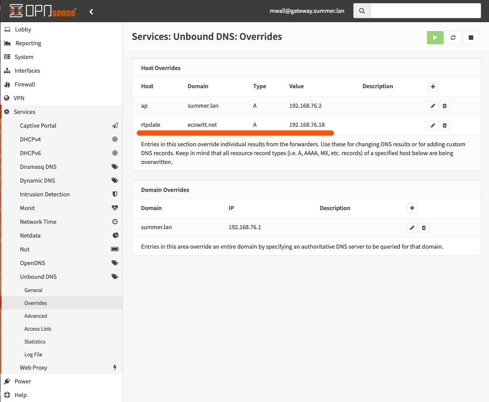

# Collect data from the ecowitt GW1000 wifi bridge

This guide shows how to configure weeWX to collect data from the ecowitt GW1000 wifi bridge.  The GW1000 is manufactured by Fine Offset.  It receives 915MHz radio signals from a wide assortment of Fine Offset sensors, then sends the data via WiFi to various online services.  The bridge itself is small, powered by USB, and has no interface other than a single button and two LEDs.  It includes pressure, temperature, and humidity sensor at the end of an attached 1 meter wire.

## What does it look like?


## What do you need?

At the very least you need a GW1000.  Then you can add any number of sensors.

| cost | description | example model | source |
|---|---|---|---|
| $20 | GW1000 | ecowitt | https://www.amazon.com/ECOWITT-Gateway-Temperature-Humidity-Pressure/dp/B07JLRFG24 |

The prices are US$ as of December 2019.

## Recipes

### Configure the GW1000

Follow the instructions that came with the GW1000.  That basically boils down to this:

1. Plug the GW1000 into a USB port.  The GW1000 only uses the USB port for power.

2. Install the WSView app on a phone.

3. Using the WSView app, connect to the GW1000 and configure it to use the local WiFi network.

If those steps were successful, you should see live temperature, humidity, and pressure data from the GW1000.

The GW1000 will immediately start trying to send data to a server at ecowitt.net, at a frequency of about one attempt per minute.  If the WiFi network is connected to the internet, the ecowitt.net server will reject the request with a response like this:

```
{"errcode":"40001","errmsg":"invalid passkey"}
```

If you happen to get an older GW1000, then the WSView app might prompt you immediately to upgrade the firmware on the GW1000.  You probably want firmware at least v1.5.5, since by then support for a wide variety of sensors had been added.  Firmware 1.4 was pretty anemic.

### Install weeWX

When you install weeWX, select `Simulator` when prompted for the station type.  You will change it later to `Interceptor` when you run the `wee_config --reconfigure` command.
```
# install weeWX
wget -qO - http://weewx.com/keys.html | sudo apt-key add -
wget -qO - http://weewx.com/apt/weewx.list | sudo tee /etc/apt/sources.list.d/weewx.list
sudo apt-get update
sudo apt-get install weewx

# shut down weeWX
sudo /etc/init.d/weewx stop

# install weewx-sdr extension and enable the driver
git clone https://github.com/matthewwall/weewx-interceptor.git
sudo wee_extension --install weewx-interceptor
sudo wee_config --reconfigure
```

### Configure the router to hijack DNS queries

The easiest way to capture data is to make the GW1000 send data to weeWX instead of "the cloud".  This is done by "hijacking" the domain name system (DNS).  You must configure your network so that when the GW1000 asks for the IP address that goes with `rtpdate.ecowitt.net`, it gets the IP address of the computer running weeWX.

To do this, you need a router that is capable of providing name lookups.

For example, if your router is running 'OPNSense' or 'PFSense', navigate to the 'Services' > 'Unbound DNS' > 'Overrides' page.  Create a host override for Host rtpdate, Domain ecowitt.net, and IP address of the computer that is running weeWX.

You can also do this with 'Tomato' (or 'TomatoUSB' or 'FreshTomato'), 'DD-WRT', and 'OpenWRT' router firmwares.  If you are running your own 'bind' server, then you can probably figure out how to do this.  If not, see the weewx-interceptor readme file for an example.



### Verify the hijacking

After you configure the router, verify that the hijack is working.  Make a DNS lookup from any computer on your network.  When you look up `rtupdate.ecowitt.net`, you should get the IP address of the computer that is running weeWX.  The two most common tools for this are `nslookup` and `dig`.

```
# nslookup rtupdate.ecowitt.net
Server:		192.168.76.1
Address:	192.168.76.1#53

Name:	rtpdate.ecowitt.net
Address: 192.168.76.18                    <- this is a local IP address, so the hijack worked!
```

### Verify that the interceptor can receive data

Run the interceptor directly:
```
sudo PYTHONPATH=/home/weewx/bin python3 /home/weewx/bin/user/interceptor.py --device=fineoffset-bridge --debug
```

Now enter a URL in a web browser that is kind of like the URL from the GW1000.
```
http://192.168.76.18/data/report?PASSKEY=AAAA7BE0B6C0FAD155BB6C7C01190EBD&stationtype=GW1000B_V1.5.5&dateutc=2019-12-29+16:27:27&tempinf=67.1&humidityin=39&baromrelin=30.138&baromabsin=30.138&freq=915M&model=GW1000
```

You should see a response from the interceptor something like this:
```
raw data: PASSKEY=AAAA7BE0B6C0FAD155BB6C7C01190EBD&stationtype=GW1000B_V1.5.5&dateutc=2019-12-29+16:27:27&tempinf=67.1&humidityin=39&baromrelin=30.138&baromabsin=30.138&freq=915M&model=GW1000
raw packet: {'humidity_in': 39.0, 'temperature_in': 67.1, 'barometer': 30.138, 'usUnits': 1, 'dateTime': 1577636847}
mapped packet: {'inHumidity': 39.0, 'barometer': 30.138, 'inTemp': 67.1, 'usUnits': 1, 'dateTime': 1577636847}
```

### Put the interceptor settings into the weeWX configuration

In the weeWX configuration file, modify the `[Interceptor]` section.  The typical configuration has the interceptor listening on port 80 on the default interface of the computer on which weeWX is running.

```
[Interceptor]
    driver = user.interceptor
    device_type = fineoffset-gw1000
```

### Other configuration options

Things get complicated if you cannot hijack DNS.  If your router does not provide name service, or if you cannot manage your router, you'll have to use a sniffing approach.  Sniffing requires one of the following:

* run weeWX on a raspberry pi that bridges the WiFi and wired networks
* use a network hub, not a switch
* use a switch that can do port mirroring

See the weewx-interceptor readme for details.

