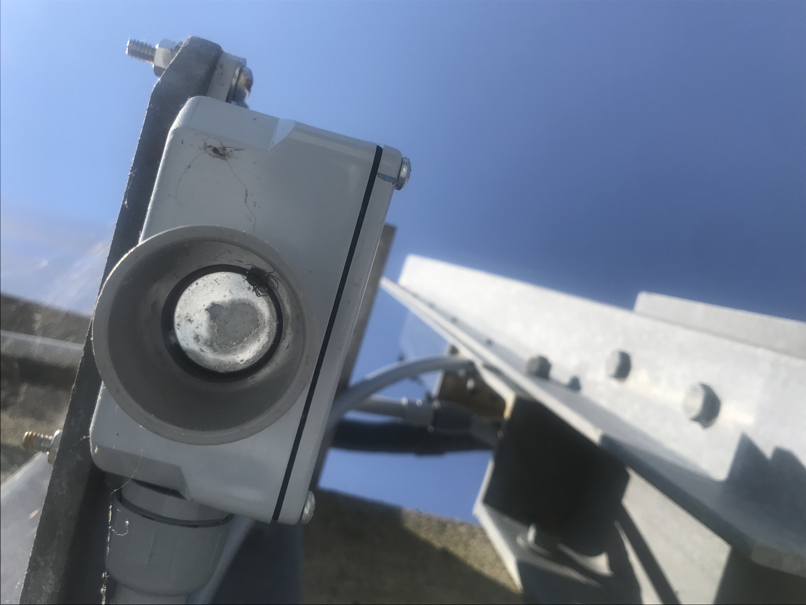

# Use Maxbotix ultrasonic sensor to measure water level

This is a guide to use a Maxbotix ultrasonic sensor to measure water level.  The ultrasonic sensors can measure the amount of water in a tank, the tide height, or even snow depth.

Maxbotix makes *many* different models of ultrasonic sensor.  The sensor capabilities vary in the resolution of measurements, the minimum distance between sensor and object, the maximum range, and the beam width.  Other options include the communication protocol and form factor.  There are even options for factory-applied coatings to inhibit corrosion.

https://maxbotix.com/

This guide uses the MB7363 HRXL-MaxSonar-WRLS, which has the following characteristics:
* resolution: 1 mm
* detection: first target
* range: 500-9999 mm
* beam angle: moderate
* read rate: 6 Hz
* communications: RS232

Data collection happens on a computer to which the sensor is attached.  The computer can be a raspberry pi, an intel NUC, or any other device that (1) can run weewx, and (2) has a serial port and/or USB port.

Note that this configuration does not have a data logger; when the computer is off, no data are collected.  So be sure to put the computer on a UPS that has enough battery to get through the longest anticipated power outage.  Even better, put the computer on a battery that is connected to a solar panel or other renewable energy source.

The recipes in this guide assume a Debian-like operating system.  The syntax will be slightly different for other operating systems, but the principles and steps are the same.

## What does it look like?

<table>
<tr>
<td>
<a href="maxbotix-recipe/MB7363.png"></a><br/>
MB7263
</td>
</tr>
<tr>
<td>
<a href="maxbotix-recipe/vh-tide-sensor.png"></a><br/>
tide monitoring
</td>
<td>
<a href="maxbotix-recipe/hi-tide-sensor.png"></a><br/>
tide monitoring
</td>
<td>
<a href="maxbotix-recipe/wls-tide-sensor.png"></a><br/>
tide monitoring
</td>
</tr>
<tr>
<td>
<a href="maxbotix-recipe/hi-four-tanks.png"></a><br/>
four water tanks
</td>
<td>
<a href="maxbotix-recipe/hi-tank-sensor.png"></a><br/>
tank sensor
</td>
<td>
<a href="maxbotix-recipe/hi-four-tank-wiring.png"></a><br/>
tank sensor wiring
</td>
</tr>
</table>

## What do you need?

| cost | description | source |
|---|---|---|
| $138 | MB7363 | https://maxbotix.com/products/mb7363 |
| $78 | RPi 3B+ | https://www.amazon.com/ELEMENT-Element14-Raspberry-Pi-Motherboard/dp/B07BDR5PDW/ |

Prices are US$ as of April 2023.

## Recipes

### Install the sensor

Connect the sensor to a serial port on the computer.  For the RS232 part, there are two approaches: (1) direct serial connection, or (2) serial via USB-serial adapter.

The sensor requires 5V power, so get that from one of the USB ports on the computer.

If you have the external temperature sensor, then connect that as well.

<table>
<tr>
<td>
<a href="maxbotix-recipe/wiring-MB7363.png">
</a><br/>
MB7363 wiring
</td>
<td>
<a href="maxbotix-recipe/wiring-db9.png">
</a><br/>
DB9 connector
</td>
<td>
<a href="maxbotix-recipe/wiring-power.png">
</a><br/>
power from USB
</td>
</tr>
<tr>
<td>
<a href="maxbotix-recipe/wiring-diagram-with-temperature.png">
</a><br/>
wiring diagram, with temperature sensor
</td>
</tr>
<table>

### Verify sensor operation

Verify the sensor operation by reading directly from the serial port.  The `screen` tool is perhaps the easiest way to do this.  If it is not already on your system, install it with your system's package manager:
```
sudo apt install screen
```

The first thing you must do is determine to which port the sensor is connected.  If the sensor is connected directly to a serial port, then the port will be `/dev/ttyS0` or `/dev/ttyS1` on most x86_64 systems running linux.  On ARM systems running linux, the serial port will be `/dev/ttyAMA0` or `/dev/ttyS0`, or there might be a symlink `/dev/serial0` or `/dev/serial1`.

Assuming that the sensor is connected to the first serial port, then invoke screen with the port as the only arguement, like this:
```
sudo screen /dev/ttyS0
```
The `sudo` is probably necessary, since non-privileged users are typically not allowed to write to the serial ports in a default system configuration.

When `screen` is running, you should see output like this:
```
R1034
```
Place an object in front of the sensor, then move it closer to and further from the sensor.  You should see the number change as you move the object.

To quit `screen`, type `ctrl-a k`, then type `y` in response to the prompt.

### Install weeWX

When you install weeWX, select `Simulator` when prompted for the station type.  You will change it later to `Maxbotix`.
```
# Install weeWX
wget -qO - http://weewx.com/keys.html | sudo apt-key add -
wget -qO - http://weewx.com/apt/weewx.list | sudo tee /etc/apt/sources.list.d/weewx.list
sudo apt-get update
sudo apt-get install weewx
```

### Install and configure the weewx-maxbotix extension

First install the weewx-maxbotix extension, configure it to use the port that you identified when you tested the sensor, verify that the weewx-maxbotix driver emits the correct data, then configure a weewx database to receive the data.

When you configure the weewx-maxbotix extension, you must specify two things: (1) which port to use, and (2) the sensor type.  The sensor type determines the minimum and maximum ranges, as well as the units of measurement.

In order to retain data, you must either add a column to an existing weewx database, or create a new weewx database with only the range data for the sensor.  The instructions below are for the latter.

```
# Shut down weeWX
sudo /etc/init.d/weewx stop

# Install weewx-maxbotix extension
sudo wee_extension --install https://github.com/matthewwall/weewx-maxbotix

# Configure weewx to use the maxbotix sensor
sudo wee_config --reconfigure

# Verify that the weewx-maxbotix driver can read the sensor
sudo PYTHONPATH=/usr/share/weewx python /usr/share/weewx/user/maxbotix.py --port /dev/ttyS0 --test-sensor
# If that worked, then verify that the driver emits packets
sudo PYTHONPATH=/usr/share/weewx python /usr/share/weewx/user/maxbotix.py --port /dev/ttyS0 --test-driver

# Configure a new weewx database to receive the data.  The changes go in the
# weewx configuration file.  Specify a simple range schema in the DataBindings,
# and specify a bespoke maxbotix database in the Databases stanza.
[DataBindings]
    [[wx_binding]]
        database = archive_sqlite
        table_name = archive
        manager = weewx.manager.DaySummaryManager
        schema = user.maxbotix.schema

[Databases]
    [[archive_sqlite]]
        database_name = maxbotix.sdb
        database_type = SQLite

# Start weeWX
sudo /etc/init.d/weewx start
```

## Troubleshooting

### Unstable sensor readings - eliminate reflections

Do not embed the sensor in a small-diameter pipe.  Ensure that the sensor is spaced sufficiently far from any walls or other obstructions that might interfere with the ranging.  See the Maxbotix specification for each sensor to see how wide/narrow the nominal beam is.

### Objects too close

Remember that every sensor has a minimum range.  For many of the sensors, that is around 30 cm.  In practice, this often means that you will have to mount the sensor above or outside the tank in which you are trying to measure, typically with a pipe to provide the extension.

### Corrosion

When deploying sensors in a corrosive environment, apply a thin silicone coating to the sensor membrane.

<table>
<tr>
<td>
<a href="maxbotix-recipe/corrosion-chlorine.png">
</a><br/>
Corrision from chlorine.  This sensor was deployed 2 feet above the maximum water level in a tank of fresh water.  Chlorine was added to the water as it was pumped into the tank, at an amount specified by the state to ensure quality drinking water.  This is corrosion after 4 years of sensing, with the tanks empty during the winter months.
</td>
<td>
<a href="maxbotix-recipe/corrosion-salt-and-spider.png">
</a><br/>
Corrosion from exposure to saltwater spray.  This sensor was mounted 2 feet above the mean high tide level.  The salt encrustation developed after only 6 months, and pitted the sensor membrane to the point where it would no longer range.  The spider was also interfering with the ranging.
</td>
</tr>
</table>

### Temperature correction

When measuring in cold temperatures, consider adding the external temperature sensor (also sold by Maxbotix).  The speed of sound in cold air is not the same as the speed of sound in warm air, and an external temperature sensor lets the maxbotix sensor adjust its measurements based on the air temperature.
