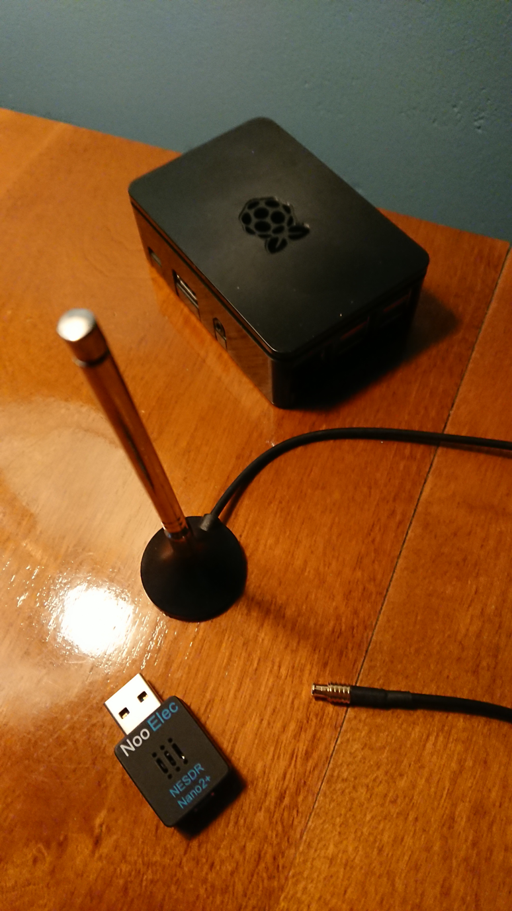
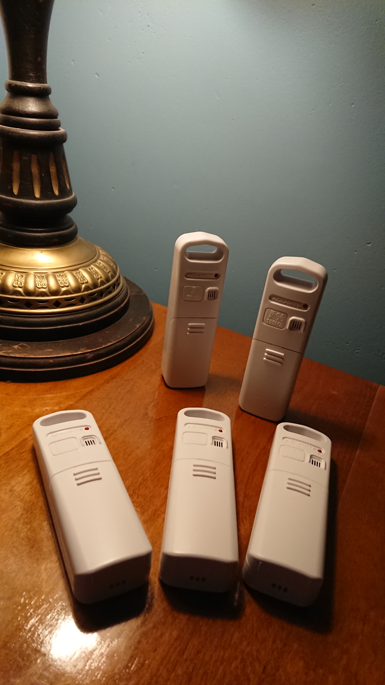
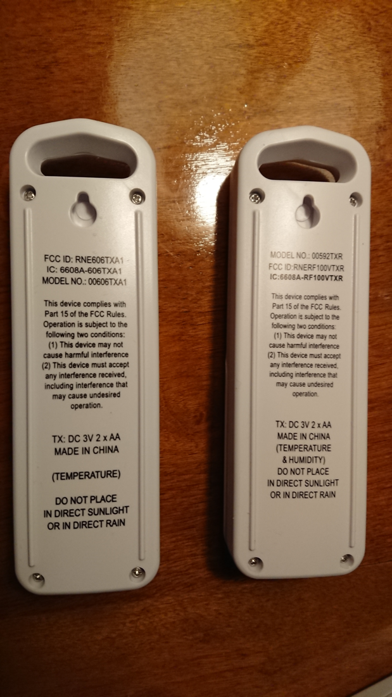

# Use software-defined radio (SDR) on raspberry pi to collect data

This is a guide to build a very low-cost system that will collect data from any number of wireless sensors.  The recipes in this guide use a USB software-defined radio (SDR) plugged in to a raspberry pi, collecting data from Acurite temperature and temperature/humidity sensors.  This approach will work with many other types of sensors from other manufacturers, and it will run on other computers, not just the raspberry pi.

## What does it look like?





## What do you need?

| cost | description | source |
|---|---|---|
| $20 | USB SDR | https://www.amazon.com/NooElec-NESDR-Mini-Compatible-Packages/dp/B009U7WZCA/ |
| $40 | RPi | |
| $15 | SD card | |
| $15 | Case | |
| $8 | Power supply | |
| $13 | Acurite 06002M temperature/humidity sensor | |
| $13 | Acurite 606TX temperature sensor | |
| $13 | FineOffset WH31 temperature/humidity sensor | |

Prices are US$ as of January 2019.

## Recipes

### Configure the raspberry pi

```
# ensure the correct timezone
sudo dpkg-reconfigure tzdata

# TODO: realtime clock steps
```

### Install rtl-sdr
```
sudo apt-get install autotools-dev
sudo apt-get install cmake
sudo apt-get install libusb-1.0-0-dev
git clone git://git.osmocom.org/rtl-sdr.git
cd rtl-sdr
mkdir build
cd build
cmake -DINSTALL_UDEV_RULES=ON ..
make
sudo make install
sudo ldconfig
```

### Install rtl_433

```
sudo apt-get install build-essential autoconf libtool pkg-config
git clone https://github.com/merbanan/rtl_433
cd rtl_433
mkdir build
cd build
cmake ..
make
sudo make install
```

### Install weeWX
```
# pre-requisites
sudo apt-get install python-imaging python-configobj python-cheetah python-serial python-usb

# install weeWX
wget -qO - http://weewx.com/keys.html | sudo apt-key add -
wget -qO - http://weewx.com/apt/weewx.list | sudo tee /etc/apt/sources.list.d/weewx.list
sudo apt-get update
sudo apt-get install weewx

# install weewx-sdr driver
git clone https://github.com/matthewwall/weewx-sdr.git
sudo wee_extension --install weewx-sdr
sudo wee_config --reconfigure
```

### configure
```
# adjust kernel module
sudo modprobe -r dvb_usb_rtl28xxu
echo dvb_usb_rtl28xxu | sudo tee /etc/modprobe.d/blacklist.conf

# see what's out there
sudo rtl_433 -G

# verify json format for the things you care about
sudo rtl_433 -M utc -F json -G

# see which packets are supported
sudo PYTHONPATH=/usr/share/weewx python /usr/share/weewx/user/sdr.py --action list-supported

# get the sensor mappings
sudo PYTHONPATH=/usr/share/weewx python /usr/share/weewx/user/sdr.py --cmd="rtl_433 -M utc -F json -G"

# look at the 'out' and 'parsed' lines
out: ['{"time" : "2019-01-16 11:45:33", "model" : "Acurite tower sensor", "id" : 2453, "sensor_id" : 2453, "channel" : "A", "temperature_C" : 16.700, "humidity" : 31, "battery_low" : 0}\n']
parsed: {'temperature.0995.AcuriteTowerPacket': 16.7, 'dateTime': 1547639133, 'humidity.0995.AcuriteTowerPacket': 31.0, 'status.0995.AcuriteTowerPacket': None, 'battery.0995.AcuriteTowerPacket': 0, 'channel.0995.AcuriteTowerPacket': u'A', 'usUnits': 16}

# create sensor_map in /etc/weewx/weewx.conf
[SDR]
    ...
    [[sensor_map]]
        inTemp = temperature.-102.Acurite606TXPacket
        outTemp = temperature.0995.AcuriteTowerPacket
        outHumidity = humidity.0995.AcuriteTowerPacket
        extraTemp1 = temperature.16B9.AcuriteTowerPacket
        extraHumidity1 = humidity.16B9.AcuriteTowerPacket
        extraTemp2 = temperature.0ED5.AcuriteTowerPacket
        extraHumidity3 = humidity.0ED5.AcuriteTowerPacket
```

### start weewx
```
sudo /etc/init.d/weewx start
```
